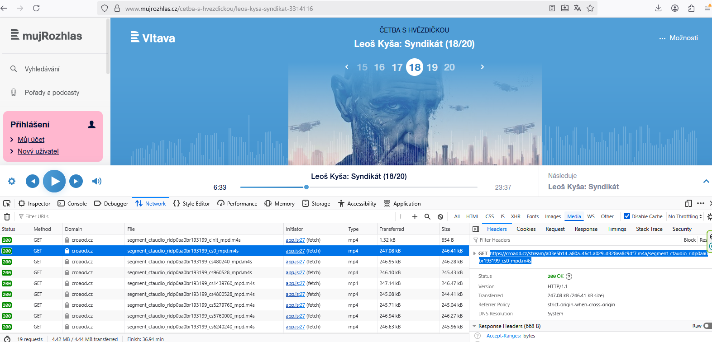

# mujrozhlas - MP3
Dokumentácia bola vytvorená za pomoci GPT5
Jednoduchý skript v Pythone, ktorý dokáže získať audio z mujrozhlas.cz tak, že nájde a spracuje zdroje z domény croaod.cz (.mpd, .mp3 alebo .m4s) a spojí ich do jedného MP3 súboru.

Dôležité: Musíte mať nainštalovaný ffmpeg. Stiahnite ho z oficiálnych stránok a umiestnite do rovnakého priečinka ako skript alebo pridajte do PATH.

## Čo skript vie
- Automaticky prehľadať stránku mujrozhlas.cz a pokúsiť sa nájsť streamy.
- Priamo stiahnuť z .mpd alebo .mp3 URL.
- Z .m4s segmentu odvodiť manifest.mpd a nahrávať cez ffmpeg.
- Výsledné časti zlúčiť do jedného MP3.

## Upozornenie na Cloudflare
Niektoré stránky sú chránené Cloudflare ochranou. V takom prípade môže automatické hľadanie zlyhať. Stále však fungujú tieto možnosti:
- Otvorte stránku v bežnom prehliadači, spustite prehrávanie, v DevTools - Network skopírujte .mpd alebo .m4s a použite túto URL ako vstup.


## Požiadavky
- Python 3.9+
- knižnice: playwright, requests
- prehliadač Chromium pre Playwright
- ffmpeg

## Inštalácia
```bash
pip install -r requirements.txt
python -m playwright install chromium
```
Stiahnite ffmpeg z https://ffmpeg.org a umiestnite binárku do rovnakého priečinka ako skript alebo do PATH.

## Spôsoby použitia
Skript podporuje tri vstupy. Použite vždy len jeden z nich.

1) URL na stránku mujrozhlas.cz - pokus o automatické nájdenie streamov
```bash
python mujrozhlas_dl.py "https://www.mujrozhlas.cz/nejaky/konkretni-diel"
```

2) Priama .mpd alebo .mp3 URL z croaod.cz - odporúčané ak automatika zlyhá
```bash
python mujrozhlas_dl.py "https://xxx.croaod.cz/.../manifest.mpd"
```

3) URL na .m4s segment z croaod.cz - skript si z nej odvodí manifest.mpd
```bash
python mujrozhlas_dl.py "https://xxx.croaod.cz/.../segment_nieco_mpd.m4s"
```

### Voliteľné prepínače
- -o, --output  nastaví názov výsledného MP3
- --keep-parts  ponechá dočasné MP3 časti

Príklady:
```bash
# Automatika s názvom odvodeným z URL
python mujrozhlas_dl.py "https://www.mujrozhlas.cz/podcasty/sci-fi/epizoda-42"

# Vlastný názov výstupu
python mujrozhlas_dl.py "https://www.mujrozhlas.cz/porad/..." -o "moj_vystup.mp3"

# Priama .mpd URL
python mujrozhlas_dl.py "https://cdn.croaod.cz/abc/manifest.mpd"

# Použitie .m4s segmentu
python mujrozhlas_dl.py "https://cdn.croaod.cz/abc/segment_ctaudio_xyz_mpd.m4s"
```




## Ako to funguje stručne
- Playwright otvorí stránku a skúša kliknúť na tlačidlá prehrávania, aby sa načítali manifesty alebo segmenty.
- URL z croaod.cz s príponou .mpd alebo .mp3 sa použijú priamo.
- Pri .m4s sa pokúsi odvodiť súvisiaci manifest.mpd a nahrávať cez ffmpeg do MP3 (192 kbps).
- Viaceré časti sa spoja do jedného MP3 pomocou ffmpeg concat.

## Riešenie problémov
- ffmpeg not found in PATH
  Uistite sa, že ffmpeg je v rovnakom priečinku ako skript alebo v PATH.

- No croaod.cz .mpd/.mp3 streams detected
  Skúste danú stránku otvoriť v prehliadači, spustiť prehrávanie a skopírovať .mpd alebo .m4s URL z Network panelu. Potom použite tieto URL priamo so skriptom.

- Pomalé alebo nestabilné sťahovanie
  Skontrolujte pripojenie. Pri .mpd ide o nahrávanie cez ffmpeg v reálnom čase.

## Výstup
```
Detected 3 stream URL(s)
Processing
Merging 3 parts into final.mp3
Done. Output: /cesta/k/final.mp3
```

## Licencia
MIT
